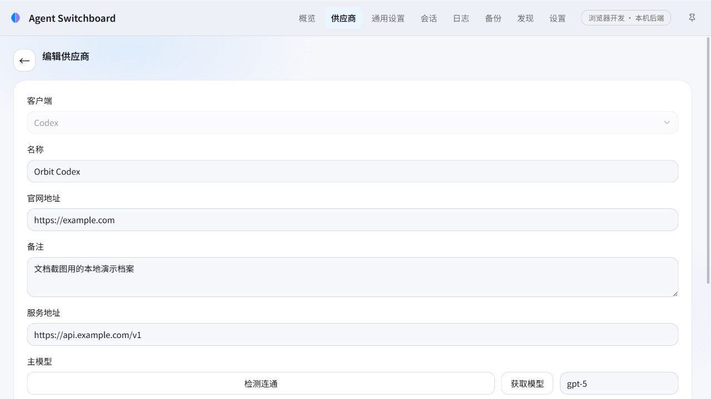
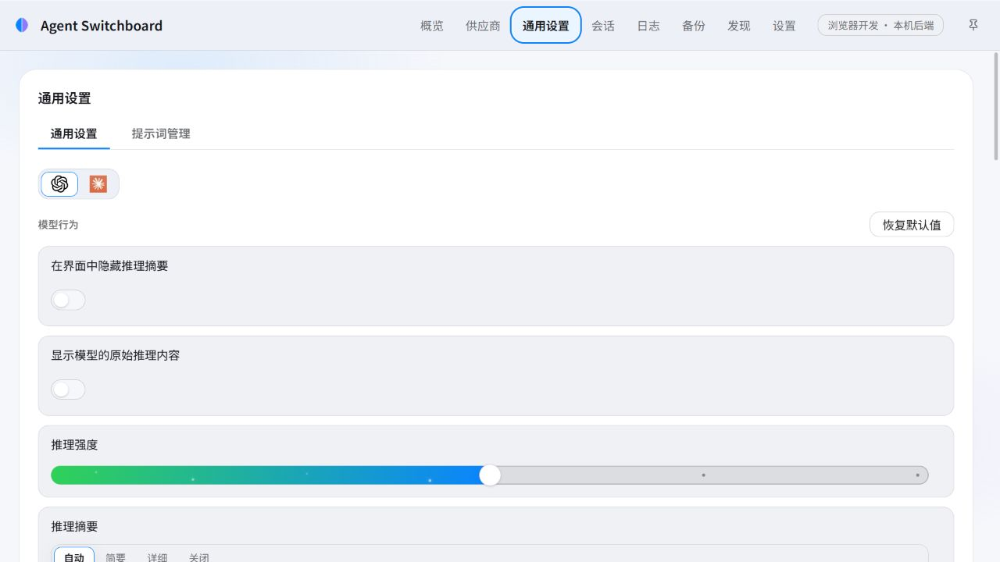
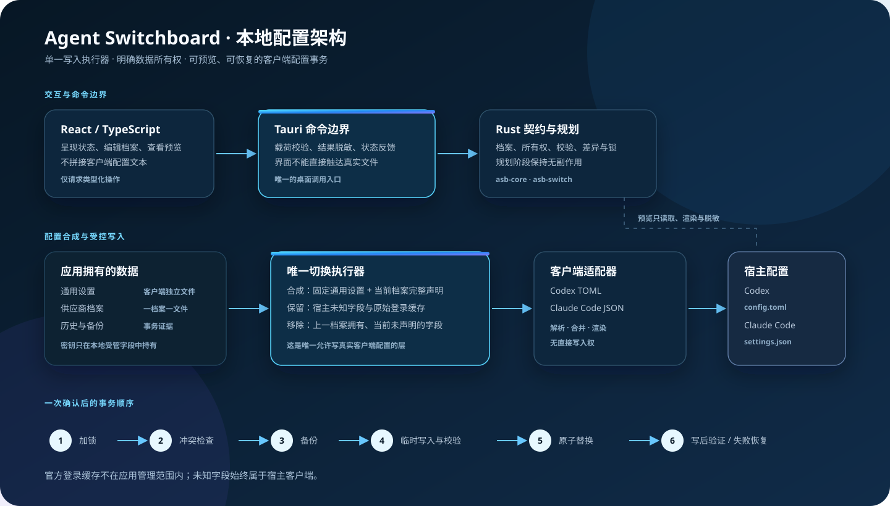

<p align="center">
  
</p>

<h1 align="center">Agent Switchboard</h1>

<p align="center">
  面向 <strong>Codex</strong> 与 <strong>Claude Code</strong> 的本地 Windows 配置控制台。<br>
  在写入前看清变更，在写入后保留可恢复的证据。
</p>

<p align="center">
  <a href="https://github.com/y4Nkk/agent-switchboard/actions/workflows/windows-package.yml"></a>
  <a href="LICENSE"></a>
  
</p>

> 这是一个**本地配置管理器**，不是模型网关、云同步服务或账号系统。它只管理 Codex 和 Claude Code 的用户级配置；不会代理请求、自动换供应商、接管官方登录缓存，或上传遥测数据。

## 界面

<p align="center">
  
</p>
<p align="center">
  
</p>

截图来自隔离的本地运行环境。仅使用虚构的演示档案与 `example.com` 地址；不包含真实服务地址、密钥、文件路径、账号、会话或应用数据。

## 它解决什么问题

在 Codex 与 Claude Code 间使用多个供应商时，配置本身既容易丢失，也很难判断一次切换究竟改了什么。Agent Switchboard 把这件事收束成一条可检查的本地流程：

1. 将通用设置与供应商档案分别保存为应用拥有的带类型文件。
2. 读取现有客户端配置，保留应用不认识的宿主字段。
3. 在写入前生成脱敏差异与候选内容哈希，等待明确确认。
4. 由唯一执行器加锁、备份、临时写入、校验、原子替换并写后验证。
5. 写入异常时恢复紧邻备份；历史、锁状态与诊断保持可见。

## 能力一览

- **双端配置路由**：分别支持 Codex `TOML` 与 Claude Code `JSON`；自定义路由与官方登录路由是两种明确状态。
- **官方登录与导入**：官方路由不保存第三方 API 密钥。启用时仅移除本应用拥有的自定义路由字段，保留原生客户端登录缓存与宿主未知字段。
- **供应商档案**：每个 Codex / Claude Code 档案是独立文件，可新建、编辑、排序、发现导入、从 CC Switch 导入或删除。
- **通用设置**：通用配置只管理跨供应商的客户端参数。页面支持保存、恢复默认值与只读配置预览，不把供应商字段混入通用设置。
- **可审查的切换**：预览、候选哈希、外部编辑冲突检查、可观察锁、备份、恢复、撤回和差异查看均走同一事务路径。
- **用量与脚本**：档案可携带声明式或受限脚本式用量查询；结果按档案展示，并仅在当前应用进程内缓存供系统托盘摘要使用。
- **Windows 托盘**：托盘按 Codex / Claude Code 分组显示可切换档案与缓存用量；选择仍经过同一预览与事务执行器，绝不绕过写入约束。
- **本机辅助工作流**：只读发现、全局提示词管理、备份与恢复、受限运行日志、端点探测、会话查看与恢复命令。

## 架构

<p align="center">
  
</p>

架构图中的关键边界是：**React 只请求类型化操作；客户端适配器只解析、合并和渲染；只有切换执行器可以写入 Codex 或 Claude Code 的真实配置。**

### 数据所有权

| 数据 | 所有者 | 处理原则 |
| --- | --- | --- |
| 通用设置 | 应用数据目录中的客户端独立文件 | 仅包含通用字段；不混入供应商或宿主字段 |
| 供应商档案 | 应用数据目录中的客户端独立文件 | 名称、模型、地址、密钥与用量查询同档案保存 |
| Codex / Claude Code 配置 | 两个宿主客户端 | 未识别字段始终按宿主所有处理；目标格式允许时原样保留 |
| 官方登录缓存 | Codex 或 Claude Code | 不读取为档案、不复制、不删除、不接管 |
| 备份与历史 | 应用本地备份目录 | 仅由事务执行器创建、验证、恢复与展示 |

密钥只允许来自编辑器输入或本机配置导入，并只保存在应用数据目录与经确认写入的受管客户端字段中。预览、差异、日志、错误、诊断和本文档中的截图都使用稳定脱敏标记，不显示密钥内容。

## 本地构建与开发

本项目为 Windows 桌面应用，使用 `Tauri 2`、Rust 与 React/TypeScript。`rust-toolchain.toml` 固定 GNU Windows 工具链；本机需要可用的 MinGW `gcc`、`windres` 与 `dlltool`。

```powershell
npm ci
cargo test --workspace
npm test -- --run
npm run tauri build
```

完成后，NSIS 安装程序位于：

```text
target\release\bundle\nsis\*-setup.exe
```

开发入口：

```powershell
# 真实本机后端 + 浏览器开发页
npm run dev

# 可见的原生 Tauri 窗口，用于托盘与 WebView2 验证
npm run dev:desktop
```

每次推送都会运行 Windows 打包工作流：安装 Node 22 和 GNU Rust/MinGW，执行 Rust 与前端测试，生成 NSIS 安装包，并把安装包保留为 GitHub Actions 制品 30 天。推送 `v*` 标签时，工作流还会把该安装包发布为正式 GitHub Release。当前是否存在可下载正式版本以 [Releases](https://github.com/y4Nkk/agent-switchboard/releases) 页面为准。

## 明确不做的事

- 不管理 Codex 与 Claude Code 之外的编程客户端。
- 不替代官方登录，也不修改其凭据缓存。
- 不运行应用自有云端、遥测、代理、账户或自动故障转移服务。
- 不使用 CDP 注入、安装包补丁、`app.asar` 补丁，或改写 Codex 会话 / SQLite。
- 不在未经确认时创建或替换真实客户端配置文件。

## 项目边界与致谢

[CC Switch](https://github.com/farion1231/cc-switch) 与 [Codex++](https://github.com/BigPizzaV3/CodexPlusPlus) 仅为行为与架构研究输入。本项目拥有独立的契约、测试、界面、文案和实现；不复制两者的源码、视觉资源、交互模式或安装脚本。特别地，Codex++ 采用 `AGPL-3.0-only`，本项目未采用或改编其代码。

产品名称 `Codex`、`Claude Code` 及相关商标归其各自权利人所有；Agent Switchboard 与 OpenAI、Anthropic 均无隶属、认可或合作关系。

## 文档

| 文档 | 职责 |
| --- | --- |
| [DESIGN.md](DESIGN.md) | `Frosted Relay` 视觉与交互契约 |
| [MEMORY.md](MEMORY.md) | 已验证的长期工程决策与陷阱 |
| [progress.md](progress.md) | 唯一的阶段目标、验收与退出条件 |
| [AGENTS.md](AGENTS.md) | 贡献、工作边界与安全规则 |

## 许可证

本仓库中由 Agent Switchboard 编写的源码与文档以 [MIT License](LICENSE) 发布。第三方依赖继续遵守各自的许可证；本许可证不授予任何第三方商标的使用权。
