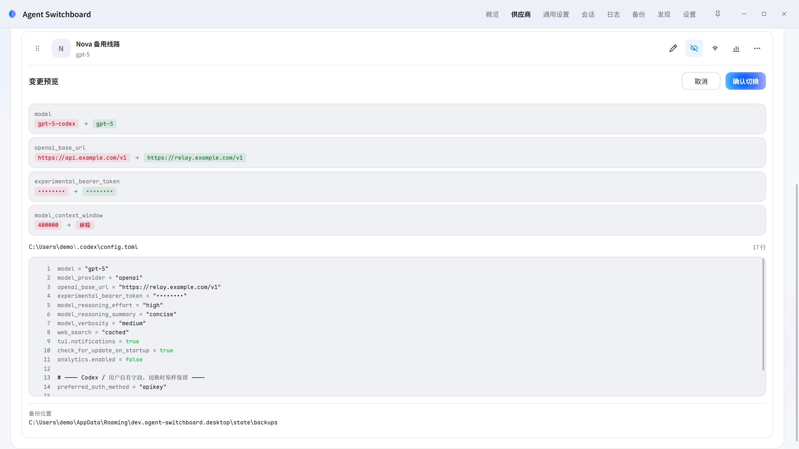

<p align="center">
  
</p>

<h1 align="center">Agent Switchboard</h1>

<p align="center">
  面向 <strong>Codex</strong> 与 <strong>Claude Code</strong> 的本地供应商配置控制台（Windows / macOS / Linux）。<br>
  通用设置可视化编辑，供应商档案独立管理；写入前可预览，写入后可恢复。
</p>

<p align="center">
  <a href="https://github.com/y4Nkk/agent-switchboard/actions/workflows/package.yml"></a>
  <a href="LICENSE"></a>
  
</p>

Agent Switchboard 把多供应商使用下最容易出错的环节——手改客户端配置文件——收束为一条可检查的本地流程。它管理两份数据：与供应商无关的**通用设置**，以及每个供应商一份的**自定义档案**；启用供应商时由应用将两者合成为最终配置，经确认后写入 Codex / Claude Code 的用户级配置文件。

> **注意**：项目仍处于开发阶段，可能存在未知缺陷。所有写入均先创建备份，仍建议在重要变更前自行保留配置副本。

## 界面

<p align="center">
  
</p>
<p align="center">
  
</p>
<p align="center">
  
</p>

截图来自隔离的演示环境。仅使用虚构的演示档案与 `example.com` 地址；不包含真实服务地址、密钥、文件路径、账号、会话或应用数据。

## 功能特性

**配置管理**

- **通用设置可视化编辑**：基础参数以开关、滑块与档位控件编辑，每个参数明确记录为「自动」或显式值，无需手写 TOML / JSON；页面另含「官方设置目录」与「全局指令」（直接编辑真实的 `AGENTS.md` / `CLAUDE.md`）两个标签。
- **供应商档案**：每个供应商一份独立档案（名称、模型、服务地址、密钥等），支持新建、编辑、拖拽排序与删除；可从本机现有配置只读发现导入，或从 CC Switch 一键导入。
- **双端路由**：分别适配 Codex `TOML` 与 Claude Code `JSON`；自定义路由与官方登录路由是两种明确状态，官方登录由应用发起官方 OAuth（Codex 设备码 / Claude PKCE），凭据仅写入客户端本地登录缓存。

**写入安全**

- **可审查的切换**：启用前生成脱敏差异与候选文件全文，确认后由唯一执行器完成「加锁 → 备份 → 校验 → 原子替换 → 写后验证」；外部编辑冲突与占用锁会阻止写入。
- **可恢复**：备份历史一键恢复、撤回上一次切换；恢复前快照同样可回退。
- **宿主字段保留**：应用不识别的配置字段始终按客户端所有，切换与恢复原样保留。

**周边能力**

- **Codex 官方订阅额度**：官方登录档案只读显示限额窗口用量百分比与重置时间。
- **系统托盘**：按客户端分组快速切换，选择仍走同一预览与事务流程。
- **会话**：只读浏览本机 Codex / Claude Code 会话记录，一键在新终端恢复。
- **用量与探测**：供应商可配置用量余额查询（声明式或受限脚本）与端点连通检测。
- **备份与日志**：本地备份历史之外，还可接入用户自有的 Supabase 项目做端到端加密云端备份；应用运行日志分级可调。

## 设计边界

- 最终配置由「通用设置 + 当前供应商声明」合成；上一供应商拥有而当前未声明的字段会被清理，未识别字段保持不变。
- 只有一条写入路径：界面仅发出类型化请求，真正写文件的只有切换执行器。
- 密钥只保存在应用数据目录与经确认写入的受管客户端字段中；预览、差异、日志与错误一律脱敏。
- 本地运行：不是模型网关，不代理或转发请求；没有账号体系与遥测；不接管、不读取、不复制官方登录缓存；不使用 CDP 注入、安装包补丁或改写会话 / SQLite；未经确认不创建或替换任何真实客户端配置文件。

## 下载

安装包从 [Releases](https://github.com/y4Nkk/agent-switchboard/releases) 获取，当前是否存在已发布版本以该页面为准：

| 平台 | 产物 |
| --- | --- |
| Windows 10 / 11 (x64) | NSIS 安装程序 `*-setup.exe` |
| macOS Apple Silicon | `*-aarch64.dmg` |
| macOS Intel | `*-x64.dmg` |
| Linux (x64) | `*.deb` 与 `*.AppImage` |

## 本地构建与开发

本项目为 `Tauri 2` 桌面应用，Rust + React/TypeScript。Windows 开发使用 `rust-toolchain.toml` 固定的 GNU 工具链，本机需要可用的 MinGW `gcc`、`windres` 与 `dlltool`；macOS / Linux 开发者请导出 `RUSTUP_TOOLCHAIN=stable` 覆盖该 pin，Linux 另需 WebKitGTK 构建依赖（`libwebkit2gtk-4.1-dev`、`libayatana-appindicator3-dev`、`librsvg2-dev` 等）。

```bash
npm ci
cargo test --workspace
npm test -- --run
npm run tauri:build:windows   # 或 tauri:build:macos / tauri:build:linux
```

安装包输出位置：

```text
target/release/bundle/nsis/*-setup.exe      # Windows
target/release/bundle/dmg/*.dmg             # macOS
target/release/bundle/deb/*.deb             # Linux
target/release/bundle/appimage/*.AppImage   # Linux
```

开发入口：

```bash
# 真实本机后端 + 浏览器开发页
npm run dev

# 可见的原生 Tauri 窗口，用于托盘与系统 WebView 验证
npm run dev:desktop
```

每次推送都会运行三端打包工作流：四个 job（Windows NSIS、macOS 双架构 dmg、Linux deb + AppImage）各自执行 Rust 与前端测试、构建安装包并保留为 GitHub Actions 制品 30 天；所有产物在发布前逐个执行凭据扫描。推送 `v*` 标签时，工作流会将已完成构建并通过扫描的安装包发布为正式 GitHub Release；某个平台失败不会阻止其他可用安装包发布，未显示的平台没有可发布产物。CNB 同时通过根目录 `.cnb.yml` 在 Linux Runner 上自动执行 Rust 与前端验证。

## 项目边界与致谢

[CC Switch](https://github.com/farion1231/cc-switch) 与 [Codex++](https://github.com/BigPizzaV3/CodexPlusPlus) 仅为行为与架构研究输入。本项目拥有独立的契约、测试、界面、文案和实现；不复制两者的源码、视觉资源、交互模式或安装脚本。特别地，Codex++ 采用 `AGPL-3.0-only`，本项目未采用或改编其代码。

产品名称 `Codex`、`Claude Code` 及相关商标归其各自权利人所有；Agent Switchboard 与 OpenAI、Anthropic 均无隶属、认可或合作关系。

## 文档

| 文档 | 职责 |
| --- | --- |
| [DESIGN.md](DESIGN.md) | `Frosted Relay` 视觉与交互契约 |
| [progress.md](progress.md) | 唯一的阶段目标、验收与退出条件 |
| [AGENTS.md](AGENTS.md) | 贡献、工作边界与安全规则 |

## 许可证

本仓库中由 Agent Switchboard 编写的源码与文档以 [MIT License](LICENSE) 发布。第三方依赖继续遵守各自的许可证；本许可证不授予任何第三方商标的使用权。
